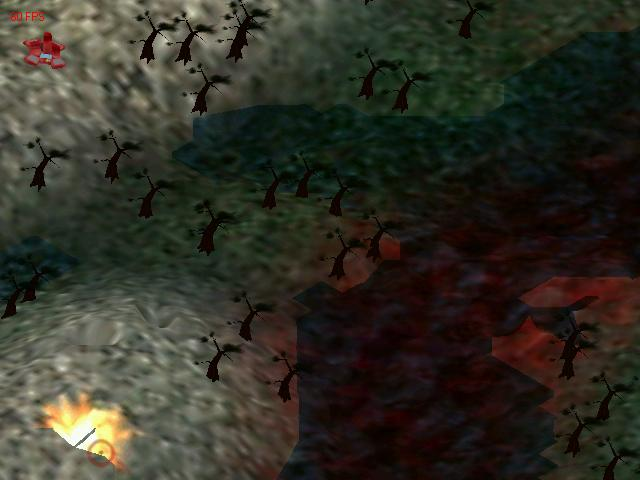

<div align="center">

## DirectX8 3D tank 'game'


</div>

### Description

This is a 3D tank 'game'. you control the tank on the landscape. You can fire missiles from the tank that forms craters in the land where it hits, or blows up trees. There is full collision detection. Read the readme.txt file in the zip for features and how to play. I created this to show off what TrueVision3D ( the 3D engine) can do, as well as to teach others how to use it. If it is worthy, please vote :)

----

I cant upload to PSC, please get it at:

http://storm.prohosting.com/eric650/game3.zip
 
### More Info
 


<span>             |<span>
---                |---
**Submitted On**   |
**By**             |[Eric650](https://github.com/Planet-Source-Code/PSCIndex/blob/master/ByAuthor/eric650.md)
**Level**          |Intermediate
**User Rating**    |5.0 (25 globes from 5 users)
**Compatibility**  |VB 5\.0, VB 6\.0
**Category**       |[DirectX](https://github.com/Planet-Source-Code/PSCIndex/blob/master/ByCategory/directx__1-44.md)
**World**          |[Visual Basic](https://github.com/Planet-Source-Code/PSCIndex/blob/master/ByWorld/visual-basic.md)
**Archive File**   |[](https://github.com/Planet-Source-Code/eric650-directx8-3d-tank-game__1-25406/archive/master.zip)


### Source Code

```
I keep getting an error when I try to upload my zip file, so please go here to download it:
http://storm.prohosting.com/eric650/game3.zip
going to that link will bring up a new page, you must click on the link on this new page to begin the download
```

